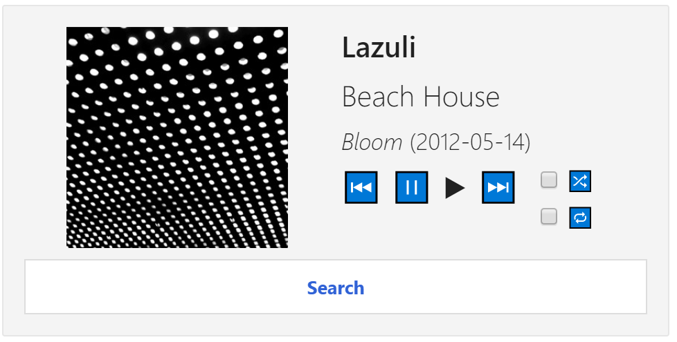
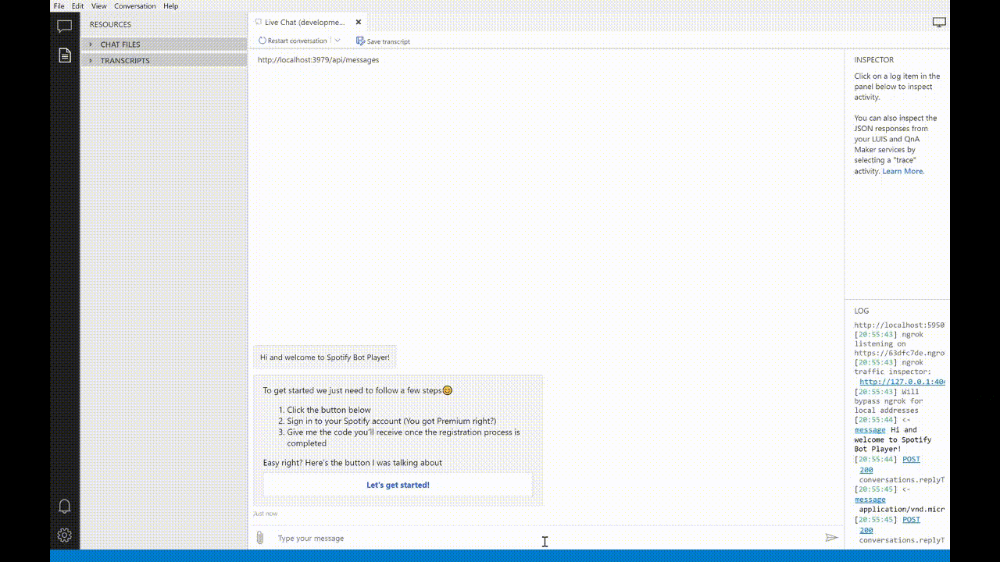

# Spotify Player Bot

This bot helps you listening to your favorite tracks via Spotify through quick and easy conversations which controls your Spotify Player.
This bot has been created using [Microsoft Bot Framework][1].

# Prerequisites
- [Visual Studio 2017 15.7][2] or newer installed.
- [.Net Core 2.1][3] or higher installed.  
- [Bot Framework Emulator 4.1][6] or newer installed

# Set up Spotify
- Navigate to [Spotify Developer Dashboard][7]
- Sign in to your Spotify Premium account
- Click *CREATE A CLIENT ID*
- Supply name, description and type
- Accept Spotifys all [license agreements][8] to create your non-commercial app
- Once the app is created store your *Client ID* and *Client Secret* as they will be used later
- Click *Edit Settings*
- Supply *http://localhost:3979/callback* as a **Redirect URI**, click *Add* and *Save*

# Running Locally

## Visual Studio
- Open SpotifyPlayerBot.csproj in Visual Studio.
- Open appSettings.json
- Add your *Client ID* as "spotifyAppId" and your *Client Secret* as "spotifyAppSecret"
- Run the project (press `F5` key).

## Testing the bot using Bot Framework Emulator
[Microsoft Bot Framework Emulator][5] is a desktop application that allows bot 
developers to test and debug their bots on localhost or running remotely through a tunnel.
- Install the [Bot Framework emulator][6].

## Connect to bot using Bot Framework Emulator **V4**
- Launch the Bot Framework Emulator.
- File -> Open bot and open [SpotifyPlayerBot.bot](SpotifyPlayerBot.bot).

# Using the Spotify Player Bot
The Spotify Player Bot can control your player via the Control card:
 Such as play, pause, switching tracks, search and toggling repeat/shuffle. There is also ability to search for tracks and artists.

Spotify Player Bot can handle simple text input such as:
- play
- pause
- next
- previous
- search {artist, track or both}

# Spotify Developer Terms of Service
Please be aware of Spotify Developer Terms of Service if you intend to use any of this work.
You can find [Spotify Developer Terms of Service][8] here.

[1]: https://dev.botframework.com
[2]: https://docs.microsoft.com/en-us/visualstudio/releasenotes/vs2017-relnotes
[3]: https://dotnet.microsoft.com/download/dotnet-core/2.1
[4]: https://docs.microsoft.com/en-us/azure/bot-service/bot-service-overview-introduction?view=azure-bot-service-4.0
[5]: https://github.com/microsoft/botframework-emulator
[6]: https://aka.ms/botframeworkemulator
[7]: https://developer.spotify.com/dashboard/
[8]: https://developer.spotify.com/terms/